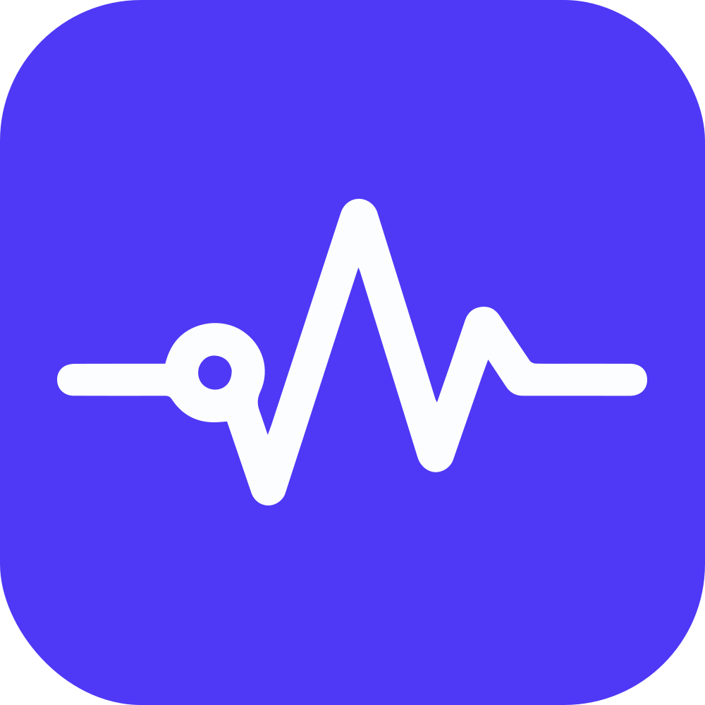

<p align="center">
  
</p>

# OpenWatch

> Open-source application monitoring and telemetry platform — a self-hosted alternative to Laravel Nightwatch.

OpenWatch collects real-time telemetry from your PHP applications and provides analytics, issue tracking, and threshold-based alerting, all in a single self-hosted dashboard.

> **Status:** Active development — not yet production-ready.

[](https://github.com/Nyamort/OpenWatch)


---

## Features

- **Multi-tenant** — Organizations, projects, and environments with role-based access (Owner, Admin, Developer, Viewer)
- **13 telemetry types** — requests, queries, cache events, commands, jobs, scheduled tasks, mail, notifications, outgoing requests, exceptions, logs, users
- **Analytics dashboards** — period-aware charts and sortable/searchable tables for every telemetry type
- **Alert rules** — configurable threshold alerts with email notifications for trigger and recovery
- **Audit log** — immutable, owner/admin-only record of all team and configuration changes
- **Two-factor authentication** — TOTP-based 2FA via Laravel Fortify
- **Ingestion API** — lightweight gzip-compressed batch endpoint; tokens stored as SHA-256 hashes
- **Data retention** — configurable per-environment TTL with automatic purge

## Tech Stack

| Layer | Technology |
|-------|------------|
| Backend | Laravel 12, PHP 8.5 |
| Frontend | React 19, TypeScript, Inertia.js v2, Tailwind CSS v4 |
| Database | MySQL 8 (SQLite for testing), ClickHouse 24 |
| Cache / Queue | Redis 7 |
| Auth | Laravel Fortify (2FA, email verification) |
| Tests | Pest 4 |

---

## Deployment

Docker images are published to the GitHub Container Registry:

```
ghcr.io/nyamort/openwatch:latest           # standard image (PHP-FPM + Nginx)
ghcr.io/nyamort/openwatch:standalone       # all-in-one image
```

### Option 1 — Docker Compose (recommended)

Separate containers for the app, queue worker, scheduler, MySQL, Redis, and ClickHouse.

```bash
# 1. Download the compose file
curl -o docker-compose.prod.yml \
  https://raw.githubusercontent.com/Nyamort/OpenWatch/main/docker/production/docker-compose.prod.yml

# 2. Create your environment file
cp .env.example .env   # or create from scratch — see required variables below

# 3. Start
docker compose -f docker-compose.prod.yml up -d
```

On first boot, the `app` container runs database migrations automatically. The worker and scheduler start once the app is healthy.

**Required environment variables:**

| Variable | Description |
|----------|-------------|
| `APP_KEY` | Laravel app key (`php artisan key:generate --show`) |
| `APP_URL` | Public URL, e.g. `https://watch.example.com` |
| `DB_PASSWORD` | MySQL password |
| `DB_ROOT_PASSWORD` | MySQL root password |

### Option 2 — Standalone (single container)

Everything bundled in one container — MySQL, Redis, ClickHouse, PHP-FPM, Nginx, queue worker, and scheduler.

```bash
docker run -d \
  --name openwatch \
  -p 80:80 \
  -e APP_KEY="base64:your-key-here" \
  -e APP_URL="http://your-server-ip" \
  -e DB_PASSWORD="secret" \
  -v openwatch-mysql:/var/lib/mysql \
  -v openwatch-clickhouse:/var/lib/clickhouse \
  -v openwatch-storage:/var/www/html/storage \
  ghcr.io/nyamort/openwatch:standalone
```

Databases are initialized automatically on first run. All data is persisted in the named volumes.

---

## Architecture

### Multi-tenant hierarchy

```
Organization → Project → Environment → Telemetry records
```

Every telemetry record is scoped to an `(organization_id, project_id, environment_id)` tuple. Cross-org data isolation is enforced at the middleware and Eloquent scope levels.

### Ingestion flow

```
Agent SDK  →  POST /api/agent-auth  →  session token (Redis, 1 h TTL)
           →  POST /api/ingest      →  ProcessTelemetryBatch (queued)
                                    →  telemetry_records + extraction_{type} tables
```

The ingestion token is stored as a SHA-256 hash. The raw token is returned exactly once at creation.

### Telemetry types

`request` · `query` · `cache-event` · `command` · `log` · `notification` · `mail` · `queued-job` · `job-attempt` · `scheduled-task` · `outgoing-request` · `exception` · `user`

Each type fans out into a typed extraction table for efficient analytical queries.

### Scheduled jobs

| Job | Schedule | Purpose |
|-----|----------|---------|
| `EvaluateAlertRules` | Every minute | Check thresholds, send trigger/recovery emails |
| `RefreshProjectHealth` | Every 5 minutes | Update environment health status |
| `PurgeExpiredTelemetryRecords` | Daily | Hard-delete records past the retention window |
| `AnonymizeStaleAuditEvents` | Daily | Anonymize PII in old audit entries |

---

## Contributing to OpenWatch

See [docs/development.md](docs/development.md) for setup instructions, local development workflow, and useful commands.

## Contributing

Contributions are welcome. Please read [CONTRIBUTING.md](CONTRIBUTING.md) before opening a pull request.

## Security

If you discover a security vulnerability, please follow the process described in [SECURITY.md](SECURITY.md). Do **not** open a public issue.

## License

OpenWatch is open-source software licensed under the [MIT license](LICENSE).
