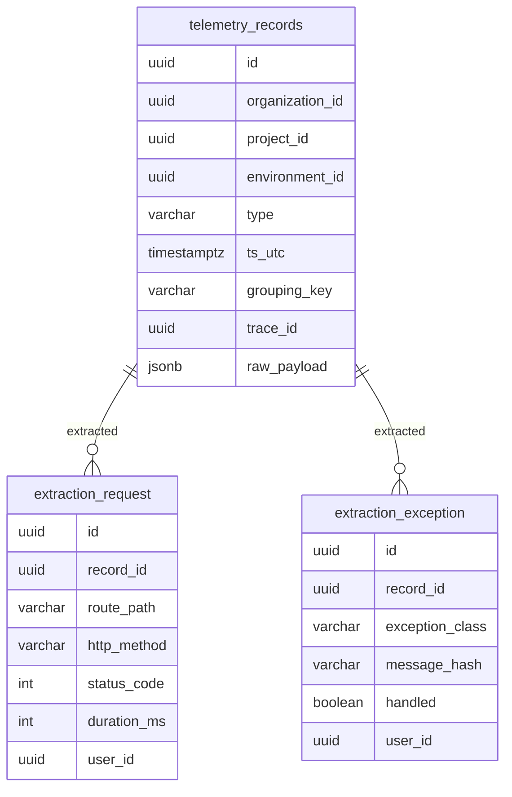

# Technical Specifications - Analytics Platform

## 1. Core storage model

Event ingestion is persisted in a partitioned table `telemetry_records`:

```
telemetry_records (partitioned by ts_utc, monthly)
├── id              uuid, PK
├── organization_id uuid, NOT NULL
├── project_id      uuid, NOT NULL
├── environment_id  uuid, NOT NULL
├── type            varchar (request|query|cache-event|...), NOT NULL
├── ts_utc          timestamptz, NOT NULL  ← partition key
├── payload_version smallint, DEFAULT 1
├── grouping_key    varchar  ← normalized fingerprint for grouping
├── trace_id        uuid     ← cross-record correlation
├── execution_id    uuid     ← parent execution reference
└── raw_payload     jsonb    ← full record preserved for forensic rendering
```



Normalized extraction tables (read models for high-cardinality dimensions):
- `extraction_request`: route_path, http_method, status_code, duration_ms, user_id.
- `extraction_exception`: exception_class, message_hash, handled flag, user_id, server.
- `extraction_query`: query_signature_hash, sql_preview, connection, duration_us.
- `extraction_job`: job_id, job_name, connection, queue, status, duration_ms.
- Similar extraction tables for: mail, notification, command, scheduled_task, outgoing_request, cache_event, log, user.

Raw JSON preserved in `raw_payload` for forensic detail rendering — never reparse for list queries.

## 2. Shared query pipeline

Dedicated query classes per responsibility:

```
ListAnalyticsQuery         → paginated list output per type
AnalyticsAggregateQuery    → chart metrics and header cards
AnalyticsBucketQuery       → time-bucketed series for charts
CorrelationQuery           → cross-page links via trace_id/_group/execution_id
```

Standard query params shared across all pages:
- `organization_id`, `project_id`, `environment_id` (from context, not user input)
- `from`, `to` (UTC timestamps, derived from period preset)
- `search` (text, applied to searchable fields per type)
- `page`, `per_page` (default 25)
- `sort`, `direction` (column name + asc/desc)
- Page-specific filters (e.g. `user`, `status`, `connection`)

Query composition pattern:
1. Apply scope guard: `WHERE organization_id = ? AND project_id = ? AND environment_id = ?`.
2. Apply time window: `AND ts_utc BETWEEN ? AND ?`.
3. Apply type filter: `AND type = ?`.
4. Apply page-specific filters.
5. Apply search if provided.
6. Apply sort + pagination.

Caching: `ListAnalyticsQuery` results cached for 15–30 seconds using Redis with scope-aware key `analytics:{org}:{project}:{env}:{type}:{period_hash}:{filters_hash}`.

## 3. Time bucketing and charting

Bucketing rules are centralized in `AnalyticsBucketService`:

| Period | Bucket size | Max buckets |
|--------|-------------|-------------|
| `1h` | 30 seconds | 120 |
| `24h` | 15 minutes | 96 |
| `7d` | 2 hours | 84 |
| `14d` | 4 hours | 84 |
| `30d` | 6 hours | 120 |
| `custom` | auto-derived | ≤ 300 |

Custom period auto-derivation: `bucket_size = ceil((to - from) / 300)`, rounded to nearest clean boundary (1m, 5m, 15m, 1h, 6h, 1d).

Bucket alignment: all buckets are aligned to UTC boundaries (e.g. 15-minute buckets start at :00, :15, :30, :45). No partial buckets — `DATE_TRUNC` used for alignment in PostgreSQL.

Response includes `bucket_start_utc` (ISO8601) for each bucket. Empty buckets are included with zero values — frontend does not interpolate gaps.

## 4. Index strategy

Mandatory indexes on `telemetry_records` for all list endpoints:

```sql
-- Primary list index
CREATE INDEX idx_telemetry_scope_type_ts
  ON telemetry_records (organization_id, project_id, environment_id, type, ts_utc DESC);

-- Correlation indexes
CREATE INDEX idx_telemetry_trace
  ON telemetry_records (organization_id, environment_id, type, trace_id);

CREATE INDEX idx_telemetry_grouping
  ON telemetry_records (organization_id, environment_id, type, grouping_key);
```

Domain-specific indexes on extraction tables:

```sql
-- Request: route grouping
CREATE INDEX idx_ext_request_route ON extraction_request (project_id, environment_id, route_path, ts_utc DESC);

-- Exception: signature grouping
CREATE INDEX idx_ext_exception_sig ON extraction_exception (project_id, environment_id, message_hash, ts_utc DESC);

-- Query: signature grouping
CREATE INDEX idx_ext_query_sig ON extraction_query (project_id, environment_id, query_signature_hash, ts_utc DESC);
```

Covering indexes for common sort columns added per-page spec.

## 5. Frontend data contracts

One standardized response shape for all analytics pages:

```typescript
{
  summary: {
    total: number,
    // page-specific metrics (e.g. avg_ms, p95_ms, handled, unhandled)
    [key: string]: number | string
  },
  series: Array<{
    bucket_start_utc: string,  // ISO8601
    // metric values per bucket
    [key: string]: number
  }>,
  rows: Array<{
    // page-specific row fields
    [key: string]: unknown
  }>,
  pagination: {
    current_page: number,
    per_page: number,
    total: number,
    last_page: number
  },
  filters_applied: {
    period: string,
    from: string,
    to: string,
    // other active filters
    [key: string]: string | null
  },
  config: {
    // chart color mapping, unit labels (ms/us/count/%)
    [key: string]: unknown
  }
}
```

Frontend receives metric names, unit labels, and color mappings from backend (`config` key) to keep frontend code decoupled from domain-specific values.

Context query state preserved in links: `project`, `environment`, `period`, and page-specific filter keys are always forwarded when navigating between analytics pages or to/from detail pages.

## 6. Security and tenant isolation

- All queries go through `AnalyticsScopeGuard` which enforces `organization_id + project_id + environment_id` before any other filter.
- Laravel global Eloquent scope on `TelemetryRecord` model enforces organization_id automatically.
- Policy checks (`can('analytics.view', $project)`) run before query execution in controllers.
- Forbidden access always returns `403` with empty result body — never a partial dataset.
- No correlation expansion across organization boundaries — `trace_id` lookup is always scoped to org.
- Optional export action (when enabled) logs: actor_id, org_id, type, period, filters_snapshot, timestamp.

## 7. Performance and SLA targets

Target response times (p95):

| Endpoint | Period | Target |
|----------|--------|--------|
| List (live, recent data) | 1h / 24h | < 200ms |
| List (aggregated, older data) | 7d+ | < 500ms |
| Summary / chart data | 1h / 24h | < 300ms |
| Summary / chart data | 7d+ | < 800ms (use materialized) |
| Detail page load | any | < 250ms |

Cache strategy:
- `summary` and `series` responses: cached 15–30 seconds (short TTL for near-real-time feel).
- `rows` list: cached 30 seconds per filter combination.
- 7d+ periods: use `dashboard_snapshots` or asynchronous materialized aggregates refreshed every 5 minutes.

Slow query monitoring:
- Alert on queries exceeding 500ms via PostgreSQL `log_min_duration_statement = 500`.
- Weekly ops task runs `EXPLAIN ANALYZE` on top slow queries from pg_stat_statements.
- Index and vacuum maintenance scheduled for large telemetry partitions.

## 8. Test strategy

Key feature tests:

- Scope isolation: query for org A cannot return data from org B (verified via test with shared trace_id).
- Bucket alignment: `24h` period returns exactly 96 buckets, all aligned to :00/:15/:30/:45.
- Custom period: auto-derived bucket size keeps ≤ 300 buckets.
- Empty buckets: response includes zero-value buckets for periods with no data.
- Cache behavior: same query within TTL returns cached response; modified data reflected after TTL.
- Pagination: `per_page=25` returns correct slice; `total` count accurate.
- Sort: all documented sortable columns produce correct ordering.
- Search: text search returns only matching rows; no SQL injection possible.
- Period default: page loads with `24h` when no period param provided.
- Forbidden: 403 returned for user without `analytics.view` permission.

## Related Resources

- **Functional Spec**: [specs.md](./specs.md)
- **Related Specs**: [projects/specs.md](../projects/specs.md), [issues/specs.md](../issues/specs.md), [alerts/specs.md](../alerts/specs.md), [dashboard/specs.md](../dashboard/specs.md)
- **Implementation Tasks**:
  - [015 - Analytics Shared Shell](./tasks/015-analytics-shared-shell.md)
  - [016 - Analytics Request Suite](./tasks/016-analytics-request-suite.md)
  - [017 - Analytics Query/Log/Mail Suite](./tasks/017-analytics-query-log-mail-suite.md)
  - [018 - Analytics Cache Event](./tasks/018-analytics-cache-event.md)
  - [019 - Analytics Command/Job Suite](./tasks/019-analytics-command-job-suite.md)
  - [020 - Analytics Outgoing/Notification/Task](./tasks/020-analytics-outgoing-notification-task.md)
  - [021 - Analytics Exception/User Suite](./tasks/021-analytics-exception-user-suite.md)
