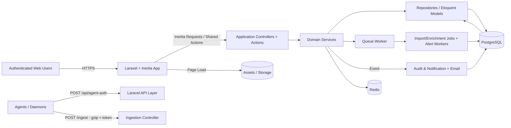

# Application Architecture (English)

Status: **Draft v1.0**

This document defines the target architecture for the product based on all functional specifications in:

- `docs/auth/specs.md`
- `docs/organisation/specs.md`
- `docs/projects/specs.md`
- `docs/api/specs.md`
- `docs/analytics/specs.md` and child analytics specs
- `docs/issues/specs.md`
- `docs/alerts/specs.md`
- `docs/dashboard/specs.md`
- `docs/user-settings/specs.md`

## 1) Strategic Architecture Overview

The project should be a **modular Laravel monolith** with clear bounded contexts (DDD-style), built on existing stack:

- `laravel/framework` (v12)
- `inertiajs/inertia-laravel` (v2)
- `laravel/fortify` (v1)
- Queue worker and cache layers

The monolith is preferred for MVP speed and consistency with existing tooling, while keeping domain boundaries strict enough to evolve toward services later if needed.

### 1.1 Logical Bounded Contexts

1. **Identity & Access Context** (`auth`, partly shared with `user-settings`)
   - Registration, login/logout/session, email verification, reset, password policy, 2FA, session lifecycle.
   - Policy consumption from Organization roles/permissions.

2. **Organization Context** (`organisation`)
   - Organization lifecycle, members, invitations, roles/permissions, ownership transfer.
   - Tenant boundaries and org-scoped context switching.

3. **Project Context** (`projects`)
   - Project/environment lifecycle, environment token lifecycle, health flags, routing metadata.

4. **Agent Ingestion Context** (`api`)
   - `/api/agent-auth`, short-lived session tokens, ingestion endpoint, payload acceptance, concurrency and backoff rules.

5. **Observability/Telemetry Context** (`analytics`)
   - Ingested event persistence, metrics aggregation, list/detail views, cross-type correlation, report endpoints.

6. **Incident Context** (`issues`)
   - Issue lifecycle, deduplication policy, occurrences, comments/activity, subscription, audit.

7. **Alerting Context** (`alerts`)
   - Threshold rules, recipients, evaluations, trigger/recovery transitions, delivery history.

8. **Experience Context** (`dashboard`, `user-settings`)
   - Dashboard aggregates and user-level preferences/profile/security controls.

Cross-cutting context:

- **Audit/Observability**: central `audit_logs` + activity events + operational metrics.
- **Platform Security**: auth hardening, rate limits, request tracing, encryption, redaction.

## 2) Recommended Runtime Architecture

## 3) Domain-Driven Structure (Inside Laravel)

Suggested directories (or equivalent):

- `app/Domain/{Auth,Organisation,Projects,Ingestion,Analytics,Issues,Alerts,UserSettings,Shared}/...`
  - `Actions/` (use-case coordinators)
  - `Domain/` (value objects, policies, states, enums)
  - `DTOs/` (typed payloads, filters, responses)
  - `Jobs/` and `Events/`
  - `Repositories/` interfaces
  - `Services/`
- `app/Http/Controllers/...` keeps thin routing adapters.
- `app/Http/Requests/...` for validation (as required by framework rules).
- `app/Models` for persistence models (where practical) with typed casts and relationships.
- `app/Policies`, `app/Observers` for authorization and side effects.

Important convention:

- **Controllers should not contain business logic**.
- **Policies are tenant-aware and must resolve organization/project/environment before decisions**.

## 4) Database & Persistence Strategy (PostgreSQL First)

### 4.1 Default Storage

Use **PostgreSQL** as primary persistence for:

- Multi-table transactional consistency (org, project, user, token, alert, issue, audit records).
- Strong tenant isolation by foreign keys and row-level constraints.
- Complex joins and aggregations (analytics filters across types, users, projects, time windows).
- ACID guarantees for sensitive operations (token rotation, owner transfer, issue lifecycle, alert transitions).

### 4.2 Suggested Telemetry Model

- `raw_telemetry_records`:
  - immutable append-only table with `event_type`, `org_id`, `project_id`, `environment_id`, `created_at`, `ts`, and `payload jsonb`.
  - partitioned by month or day (or PostgreSQL declarative partitioning strategy).
- `telemetry_events_<type>` per key aggregates/materialized views for hot read models.
- Supporting index pattern:
  - `org_id, project_id, environment_id, ts desc`
  - `event_type, ts`
  - GIN on JSONB for safe filtered fields where needed.
- Derived tables for:
  - `dashboard_snapshots` (periodic precomputed aggregates),
  - `period_metrics` by event family.

### 4.3 Cache Layer

- Redis for:
  - short-lived filter options,
  - throttling counters (ingestion/concurrency),
  - lock/queue orchestration.

## 5) Why not MongoDB for the API persistence layer (default)

For this product and specs, PostgreSQL is generally better than MongoDB as the **primary persistence**:

1. **Strong consistency and transactions**
   - token rotation + grace windows + ownership transfer + issue lifecycle all require atomic transitions.
   - Mongo supports transactions in specific deployments, but operationally complex and less integrated with Laravel defaults.

2. **Relational integrity**
   - Organization boundaries, project/environment routing, permission checks, and audit attribution are fundamentally relational.
   - Referential integrity protects against cross-tenant leaks and dangling data.

3. **Analytics query patterns**
   - Time-windowed rollups, grouped summaries, status pivots, and cross-type correlations are frequent.
   - PostgreSQL + window functions + CTEs / materialized views are efficient and predictable for these.

4. **Ecosystem fit**
- Existing Laravel ecosystem (Eloquent, policies, queues, migrations, transactions, tests) has strongest native support for SQL-first relational stores.

5. **Operational simplicity**
 - one main transactional store plus optional partitioning/archive strategy is easier to run, monitor, and govern under tenant isolation and compliance constraints.

Possible optional Mongo use (not default):

- long-term raw payload archive, if query requirements become strictly document-oriented and low-query.
- event replay/debug archive where strict relational constraints are not needed.

## 6) API and Ingestion Architecture

- `/api/agent-auth`
  - stateless validation endpoint with short-lived session token issuance.
  - `refresh_in`, `expires_in`, explicit error contracts.
  - signed audit event on success/failure.

- `POST {ingest_url}`
  - gzip contract and JSON schema checks.
  - immediate structural validation + bounded size controls.
  - `429` for concurrency limit and stop logic (`2` concurrent sessions max).
  - route returns `{}` on success.

- Ingestion pipeline:
  - controller validates transport contract;
  - enqueue parsing/normalization jobs in batches;
  - domain-specific transformers write canonical + aggregate read models;
  - alert/jobs issue evaluations happen asynchronously.

## 7) Authentication, Authorization, and Tenant Isolation

- Authentication handled by Fortify with hardened policy checks (password policy, 2FA, sessions, reset).
- Organization context middleware resolves `active_org_id` for every request needing scoped authorization.
- Policies and gates must:
  - check action permission + role at organization scope,
  - verify project/environment ownership,
  - prevent any cross-org leakage by construction (query scopes + tests + global scopes).
- Every sensitive operation is audit logged with actor, actor IP, user agent, organization, and action metadata.

## 8) Package Choices (if needed)

- **Fortify**: authentication and account security flows already present.
- **Inertia**: authenticated SPA-like frontend with Laravel conventions.
- **Queue system**:
  - database queue for small deployments,
  - Redis queue for production-scale ingestion jobs.
- **Mail sender (Symfony Mailer / Laravel Mailer)** for alert notifications.
- **Monitoring/Observability**:
  - logs to structured output,
  - queue monitoring,
  - optional OpenTelemetry/Prometheus at platform level.

> No dependency is mandatory to add in this draft document; this is a target architecture and package alignment to be aligned with current constraints before implementation.

## 9) SOLID + Architecture Principles

- **S**ingle Responsibility: one service per use case (token validation, alert evaluation, issue creation, dashboard aggregation).
- **O**pen/Closed: add new analytics event types with a handler registry instead of broad `if/else` in controllers.
- **L**iskov Substitution: use contracts/interfaces for repository + event handlers.
- **I**nterface Segregation: separate interfaces for write repository, read repository, and event parser contracts.
- **D**ependency Inversion: inject abstractions into actions/services/controllers; avoid hard dependency on concrete models in domain services.

Additional principles:

- **CQRS-like split**:
  - writes: command paths for auth, org, projects, issue/alert updates;
  - reads: analytics pages use optimized query services and read models.
- **Idempotency-first**:
  - ingestion and issue creation should defensively handle duplicates when possible (e.g. `_group`, `trace_id`, event fingerprints).

## 10) Observability and Compliance Requirements

- Audit trail:
  - login/session/token events,
  - org/project changes,
  - issue + alert lifecycle transitions.
- Security:
  - rate limiting on auth and ingestion,
  - sensitive-value redaction in logs,
  - secret material never returned or logged.
- Reliability:
  - bounded backoff for ingestion,
  - dead-letter queue for malformed payloads and parser failures.
- Deployment posture:
  - horizontal web + queue workers,
  - index and vacuum maintenance for large telemetry tables,
  - retention policy by retention plan.

## 11) Suggested Delivery Phasing (Architectural Alignment)

1. **Foundation**
   - Auth + Org + Project + API auth/ingest entry.
2. **Core Observability**
   - Analytics canonical storage + index strategy + request/query/log/mail/exception slices.
3. **Operations**
   - Issues + Alerts with audit and notifications.
4. **Experience**
   - Dashboard + User settings refinements.

---

This architecture supports the current specs as-is and leaves room to split contexts into services later without rewriting core rules.
