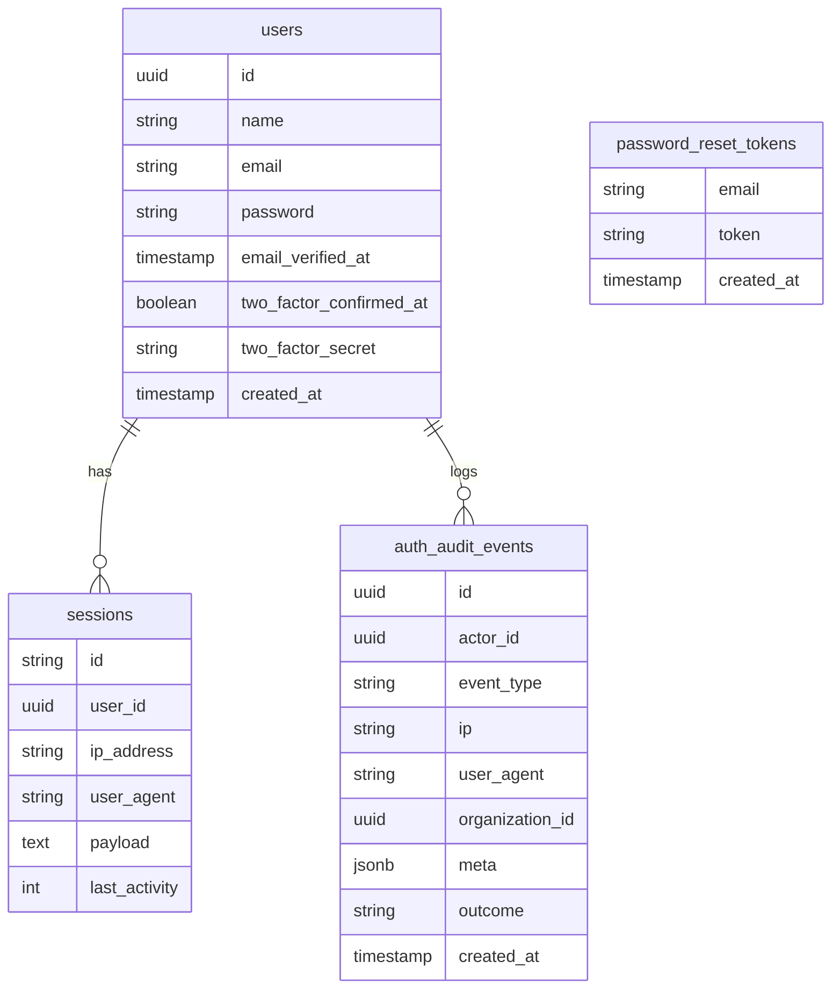

# Technical Specifications - Authentication

## 1. Stack and boundaries

- Use Laravel Fortify for credential flows, password reset, verification, and 2FA setup/challenge.
- Keep authentication service independent from organization policy resolution — the organization module remains owner of roles/permissions.
- Fortify configuration lives in `config/fortify.php`; features are selectively enabled.
- Auth routes are registered by Fortify and extended with custom views via `Fortify::loginView()` etc.

## 2. Core data model

Key tables:
- `users` and `sessions` as base entities (Laravel defaults + Fortify 2FA columns).
- `two_factor_recovery_codes`: hashed one-time codes linked to `user_id`.
- `password_reset_tokens`: single-use hashed token with expiry.
- `auth_audit_events`: append-only, immutable audit log for all auth events.
  - `event_type` values: `login.success`, `login.failure`, `logout`, `password.reset`, `password.changed`, `email.verified`, `2fa.enabled`, `2fa.disabled`, `2fa.challenge.success`, `2fa.challenge.failure`, `2fa.recovery_used`, `session.revoked`.
  - `outcome`: `success` or `failure`.

## 3. Policy and authorization

- Authentication middleware attaches `active_organization_id` to the request via `ResolveOrganizationContext` middleware before feature permission checks.
- Use Laravel Policies injected via `Gate::policy()` for role-based endpoints.
- Avoid long-lived permission caching; recompute permissions for each request or keep Redis TTL ≤ 60 seconds with invalidation on membership changes.
- Organization module is the single source of truth for roles and permissions; auth module only enforces the result.

## 4. Security controls

- Rate limiting on sensitive routes:
  - `POST /login`: 5 attempts per minute per IP + identifier.
  - `POST /forgot-password`: 3 requests per hour per IP.
  - `POST /register`: 10 per hour per IP.
- Lockout policy configurable via `config/fortify.php` `limiters` key.
- Login and verification responses are deliberately generic — no account enumeration (same response shape whether email exists or not).
- 2FA challenge accepts one TOTP code (time-based, 30s window ±1) or one recovery code (single-use).
- CSRF protection on all stateful auth routes.

## 5. Session handling

- `sessions` table stores active sessions with `ip_address`, `user_agent`, `last_activity` (unix timestamp).
- Session listing reads all rows for `user_id` with `last_activity > (now - session_lifetime)`.
- Session revocation: delete session row by `id`; cannot delete current session if `config('auth.revoke_current_session') = false`.
- On logout: `Auth::logout()` → regenerate session ID → rotate CSRF token.
- On password change: revoke all other sessions (configurable) using `Auth::logoutOtherDevices()`.
- Privileged members (Owner or Admin) can revoke any session for a user in their organization via `ForceSignOutAction`.

## 6. 2FA and recovery

- TOTP secret stored encrypted using `encrypt()` in `two_factor_secret` column.
- Recovery codes: generated as 8 random 10-character codes → hashed with `bcrypt` → stored in `two_factor_recovery_codes` table.
- Recovery code consumption: find matching hash → mark as `used_at = now()` → cannot be reused.
- Security step-up: `EnsurePasswordIsConfirmed` middleware on privileged routes (enable/disable 2FA, token rotation, ownership transfer).
- 2FA status exposed as: `disabled` (no secret), `pending_confirmation` (secret exists, not confirmed), `enabled` (confirmed).

## 7. API routes and contracts

All Fortify routes follow standard Laravel conventions. Key routes and response shapes:

| Method | Route | Response on success | Response on failure |
|--------|-------|--------------------|--------------------|
| POST | `/register` | `302` redirect or `201` (XHR) | `422` with `errors` |
| POST | `/login` | `302` redirect or `200` (XHR) | `422` (credentials), `429` (rate limit) |
| POST | `/logout` | `302` redirect | — |
| GET | `/email/verify/{id}/{hash}` | `302` redirect | `403` (invalid/expired) |
| POST | `/email/verification-notification` | `200` | `429` |
| POST | `/forgot-password` | `200` with `status` | `422` |
| POST | `/reset-password` | `302` or `200` | `422` |
| POST | `/user/two-factor-authentication` | `200` | `423` (requires password confirm), `422` |
| GET | `/user/two-factor-recovery-codes` | `200` with codes array | `403` |
| POST | `/user/two-factor-recovery-codes` | `200` | `403` |
| DELETE | `/user/two-factor-authentication` | `200` | `423` |
| POST | `/two-factor-challenge` | `302` or `200` | `422` |

HTTP status conventions:
- `422`: validation error, with `errors` object per field.
- `423`: locked — requires password confirmation step-up.
- `429`: throttled — includes `Retry-After` header.
- `403`: forbidden or link invalid.

XHR responses share the same status codes; JSON shape wraps Fortify's standard response envelope.

## 8. Test strategy

Key feature tests (Pest):

- Registration flow: valid input creates user + sends verification email; duplicate email returns 422.
- Login: valid credentials succeed; invalid credentials return generic 422 (no enumeration); locked account returns 429.
- Email verification: signed URL verifies; expired/tampered URL returns 403; resend throttled at 429.
- Password reset: valid token + new password succeeds; single-use token rejected on second use; expired token rejected.
- 2FA enable: requires password confirmation; TOTP setup flow generates QR + secret; confirm activates 2FA.
- 2FA challenge: valid TOTP accepted; expired TOTP rejected; recovery code consumed and invalidated.
- Session listing: returns correct sessions for authenticated user; revocation removes correct row.
- Audit log: all auth events write correct `event_type`, `outcome`, `actor_id`, `ip`.
- Rate limiting: exceed login attempts triggers 429 with `Retry-After`.
- Cross-user session access denied: user cannot revoke another user's session without privilege.

## Related Resources

- **Functional Spec**: [specs.md](./specs.md)
- **Related Specs**: [organisation/specs.md](../organisation/specs.md), [user-settings/specs.md](../user-settings/specs.md)
- **Implementation Tasks**:
  - [001 - Auth Foundation Core](./tasks/001-auth-foundation-core.md)
  - [002 - Auth Verification Reset](./tasks/002-auth-verification-reset.md)
  - [003 - Auth 2FA Sessions](./tasks/003-auth-2fa-sessions.md)
  - [004 - Auth Org-Scoped Policies](./tasks/004-auth-org-scoped-policies.md)
