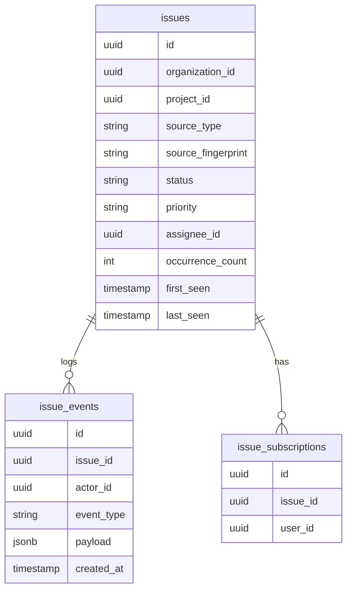

# Technical Specifications - Issue Workflow

## 1. Domain entities and data model

Core tables:

- `issues`: main issue entity.
  - `id`, `organization_id`, `project_id`, `environment_id`
  - `title` → issue title (from source context)
  - `source_type` → `exception` | `request` | `job` | `command` | `performance`
  - `source_id` → nullable, reference to originating telemetry record
  - `source_fingerprint` → stable fingerprint from originating signature (e.g. exception grouping_key)
  - `status` → `open` | `resolved` | `ignored`
  - `priority` → `none` | `low` | `medium` | `high` | `critical`
  - `assignee_id` → nullable FK to `users`
  - `resolved_at`, `resolved_by` → resolution metadata
  - `first_seen`, `last_seen` → from linked occurrences
  - `occurrence_count` → denormalized counter (updated by job on new occurrence)
  - `user_count` → denormalized distinct user count
  - `created_at`, `updated_at`

- `issue_events`: append-only audit trail for all issue lifecycle actions.
  - `id`, `issue_id`, `organization_id`, `actor_id`, `event_type`, `payload` (jsonb), `ip`, `user_agent`, `created_at`
  - `event_type` values: `created`, `status_changed`, `priority_changed`, `assigned`, `unassigned`, `commented`, `subscribed`, `unsubscribed`, `bulk_updated`

- `issue_subscriptions`: user subscriptions for issue notifications.
  - `id`, `issue_id`, `user_id`, `created_at`



## 2. Services and workflows

`IssueService` core methods:

- `createOrMerge(sourceType, sourceFingerprint, context)`: idempotent creation — finds existing `open` issue with same `(project_id, environment_id, source_fingerprint)`, returns existing if found; creates new otherwise.
- `transition(issue, status, actor)`: status lifecycle transition with audit event.
- `assign(issue, assigneeId, actor)`: assignment change with audit event.
- `setPriority(issue, priority, actor)`: priority update with audit event.
- `bulkUpdate(issueIds, changes, actor)`: transactional bulk update with preflight authorization check per issue.

Deduplication policy:
- Same `source_fingerprint` + `status = open` → merge (return existing issue, increment `occurrence_count`).
- Same `source_fingerprint` + `status = resolved|ignored` → create new issue (re-open is a separate action).
- Idempotency key: `(project_id, environment_id, source_fingerprint, status = open)`.

## 3. List query strategy

Cursor/offset pagination with sort and status/ownership filters:

```sql
SELECT i.*, u.name as assignee_name
FROM issues i
LEFT JOIN users u ON i.assignee_id = u.id
WHERE i.organization_id = ?
  AND i.project_id = ?
  AND i.status = ?               -- status filter
  AND (i.assignee_id = ? OR ...)  -- ownership filter
  AND i.source_type = ?           -- type tab filter
ORDER BY i.last_seen DESC
LIMIT 25 OFFSET ?
```

Counters for tabs: `COUNT(*) GROUP BY status` precomputed in summary query.

Sortable columns: `id`, `occurrence_count`, `user_count`, `first_seen`, `last_seen`, `assignee_id`.

## 4. Detail query strategy

Detail page loads:
1. Issue record with assignee.
2. Activity stream: `issue_events` ordered by `created_at DESC`, paginated.
3. Occurrences: linked telemetry records via `source_fingerprint` or `trace_id` correlation — paginated, filterable by `environment_id` and time window.
4. Source snapshot: latest `raw_payload` from `telemetry_records WHERE grouping_key = source_fingerprint LIMIT 1`.

Occurrences query:
```sql
SELECT * FROM telemetry_records
WHERE organization_id = ? AND grouping_key = ?
  AND ts_utc BETWEEN ? AND ?
ORDER BY ts_utc DESC
LIMIT 25 OFFSET ?
```

## 5. Bulk operations

Bulk update flow:
1. Receive `issue_ids[]` + `changes` (status | assignee_id | priority).
2. Preflight: verify each `issue_id` belongs to requesting organization + user has `issue:update` permission.
3. Execute in single transaction: `UPDATE issues SET ... WHERE id IN (?)`.
4. Write one `issue_event` per issue per changed field (batch insert).
5. Return per-row result: `{ issue_id, success: true|false, error?: string }` — partial success is acceptable.

Bulk operations are limited to 100 issues per request to prevent lock contention.

## 6. API routes and contracts

| Method | Route | Permission |
|--------|-------|-----------|
| GET | `/issues` | `issue:view` |
| POST | `/issues` | `issue:create` |
| GET | `/issues/{issue}` | `issue:view` |
| PUT | `/issues/{issue}` | `issue:update` |
| POST | `/issues/{issue}/transition` | `issue:update` |
| POST | `/issues/{issue}/subscribe` | `issue:view` |
| POST | `/issues/bulk` | `issue:update` |
| GET | `/issues/{issue}/occurrences` | `issue:view` |
| POST | `/issues/{issue}/comments` | `issue:comment` |

Key response shape for issue list:
```json
{
  "tabs": { "exceptions": 42, "performance": 8 },
  "rows": [{ "id": "...", "title": "...", "status": "open", "occurrence_count": 120, "user_count": 15, "first_seen": "...", "last_seen": "...", "assignee": null }],
  "pagination": { "current_page": 1, "total": 50 }
}
```

## 7. Security and tenant isolation

RBAC matrix:

| Action | Viewer | Developer | Admin | Owner |
|--------|--------|-----------|-------|-------|
| View issues | ✓ | ✓ | ✓ | ✓ |
| Create issue | — | ✓ | ✓ | ✓ |
| Update status/priority/assignee | — | ✓ | ✓ | ✓ |
| Comment | — | ✓ | ✓ | ✓ |
| Bulk update | — | ✓ | ✓ | ✓ |

- All issue queries scoped by `organization_id` — cross-org issue data never exposed.
- Source snapshot (`raw_payload`) access follows same `project:view` permission as analytics.
- Audit events include: `actor_id`, `organization_id`, `issue_id`, `event_type`, `ip`, `user_agent`, `created_at`.

## 8. Test strategy

Key feature tests:
- Issue creation from exception analytics: creates issue with correct `source_type`, `source_fingerprint`, `organization_id`.
- Deduplication: second creation attempt for same open fingerprint returns existing issue, not a new one.
- Reopened issue (resolved → new occurrence): creates new issue (not merged into resolved).
- Status transition: `open → resolved` stores `resolved_at` + `resolved_by`; `resolved → open` clears them.
- Assignee change audited with correct `actor_id`.
- Bulk update: partial success when one issue belongs to different org (that one fails, rest succeed).
- Viewer role: can view but cannot update, comment, or create.
- Occurrence list: returns correct telemetry records linked by `source_fingerprint`.
- Cross-organization access denied for all issue routes.

## Related Resources

- **Functional Spec**: [specs.md](./specs.md)
- **Related Specs**: [analytics/specs.md](../analytics/specs.md), [alerts/specs.md](../alerts/specs.md)
- **Implementation Tasks**:
  - [022 - Issues Core Creation](./tasks/022-issues-core-creation.md)
  - [023 - Issues List Lifecycle](./tasks/023-issues-list-lifecycle.md)
  - [024 - Issues Detail Collab](./tasks/024-issues-detail-collab.md)
