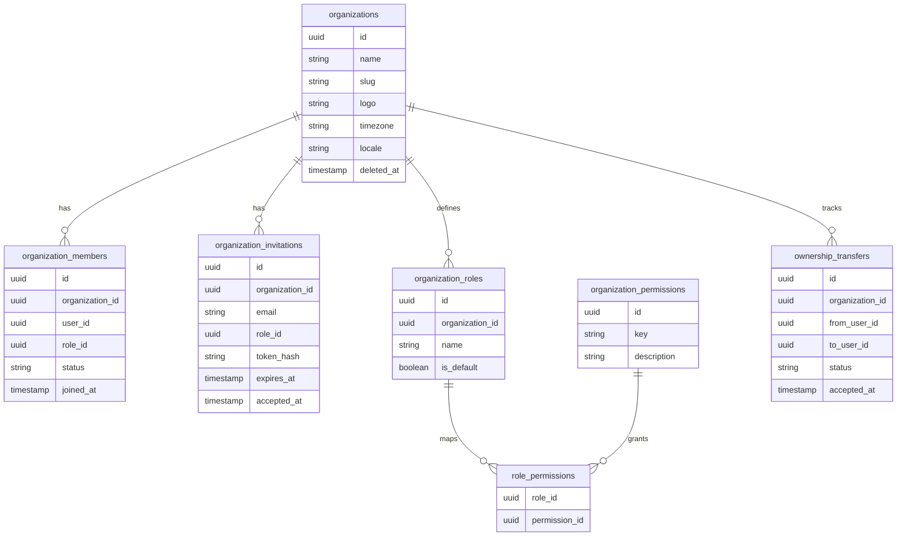

# Technical Specifications - Organization Management

## 1. Multi-tenant architecture

Every request that touches organization-scoped data goes through `ResolveOrganizationContext` middleware:
1. Read `active_organization_id` from session or URL parameter.
2. Verify user is an active member of that organization.
3. Write `$request->organization` with the resolved `Organization` model.
4. All subsequent queries use `$request->organization->id` as mandatory scope — no query proceeds without it.

Cross-organization navigation protection:
- Any route with `{project}` or `{environment}` params validates that the resolved resource belongs to `$request->organization`.
- Mismatch → immediate `403` redirect, never a data leak.

Global Eloquent scope `OrganizationScope` is applied to all organization-owned models to enforce `organization_id` filter automatically.

## 2. Data model

- `organization_members.status`: `active` | `removed`.
- `organization_invitations.token_hash`: sha256 of invitation token — shown once in email link.
- Invariant enforced at service level: at least one `active` member with Owner role per organization.

## 3. Membership and invitations

Invitation flow:
1. Admin/Owner sends invitation: generate 48-byte random token → sha256 hash stored → expiry set (default 7 days).
2. Email sent to invitee with signed URL containing plaintext token.
3. Invitee clicks link: token validated (hash match + not expired + not yet accepted + organization active).
4. On acceptance: create `organization_members` record + mark invitation `accepted_at = now()`.
5. Invitation tokens are single-use — accepting marks `accepted_at`; re-use rejected.

Role change immediacy: role updates via `MembershipService::changeRole()` take effect immediately for subsequent requests — no TTL on role resolution.

Member removal: `MembershipService::remove()` sets `status = removed`, invalidates any active invitation for that email in the org, and triggers permission cache invalidation.

Ownership transfer invariant: `remove()` and `changeRole()` both call `InvariantGuard::ensureOwnerExists()` after mutation — rolls back transaction if no active owner would remain.

## 4. Role and permission system

Permission resolver:
- `PermissionResolver::can($user, $organization, $permissionKey)` is the single entry point.
- Loads role for member → loads permissions for role → checks if `$permissionKey` in set.
- Result cached in Redis with key `permissions:{org_id}:{user_id}` TTL 60 seconds.
- Cache invalidated on: role change, member removal, role permission update.

Permission keys follow a `resource:action` pattern (e.g. `project:create`, `alert:manage`, `issue:update`).

Default permission matrix:

| Permission | Viewer | Developer | Admin | Owner |
|-----------|--------|-----------|-------|-------|
| `project:view` | ✓ | ✓ | ✓ | ✓ |
| `project:create` | — | ✓ | ✓ | ✓ |
| `issue:view` | ✓ | ✓ | ✓ | ✓ |
| `issue:update` | — | ✓ | ✓ | ✓ |
| `alert:manage` | — | ✓ | ✓ | ✓ |
| `member:invite` | — | — | ✓ | ✓ |
| `org:transfer` | — | — | — | ✓ |

## 5. Ownership transfer

Transfer flow:
1. Owner initiates transfer: creates `ownership_transfers` record with `status = pending`.
2. Email sent to recipient with signed confirmation URL.
3. Recipient accepts: `status = accepted`, recipient's role updated to Owner, initiator's role updated to Admin.
4. Step-up confirmation (password or 2FA) required for both initiation and acceptance.
5. At most one pending transfer per organization at any time.
6. Transfer cancelled automatically if initiator loses Owner role before acceptance.

All steps write audit events.

## 6. API routes and contracts

| Method | Route | Permission |
|--------|-------|-----------|
| POST | `/organisations` | authenticated |
| GET | `/organisations/{org}` | `org:view` |
| PUT | `/organisations/{org}` | `org:update` |
| GET | `/organisations/{org}/members` | `member:view` |
| POST | `/organisations/{org}/invitations` | `member:invite` |
| DELETE | `/organisations/{org}/invitations/{inv}` | `member:invite` |
| PUT | `/organisations/{org}/members/{member}/role` | `member:manage` |
| DELETE | `/organisations/{org}/members/{member}` | `member:manage` |
| POST | `/organisations/{org}/transfer` | `org:transfer` |
| GET | `/organisations/{org}/audit` | `audit:view` |

## 7. Security and isolation

- Every query includes `organization_id` guard — guaranteed by `OrganizationScope` global Eloquent scope.
- Invitation tokens: sha256 stored, token hash compared in constant-time (`hash_equals`).
- Domain restriction (optional): if org has `allowed_domains`, invitations to non-matching emails are rejected.
- Step-up confirmation (`EnsurePasswordIsConfirmed`) required for: ownership transfer, member removal, org deletion.
- Audit events for: `org.created`, `org.updated`, `member.invited`, `member.role_changed`, `member.removed`, `invitation.revoked`, `ownership.transfer_initiated`, `ownership.transfer_accepted`, `org.deleted`.

## 8. Test strategy

Key feature tests:
- Organization creation: creator automatically becomes Owner member.
- Invitation: valid token accepted once; expired token rejected; already-accepted token rejected.
- Role change: takes effect immediately for next request (no cache serving stale role).
- Invariant: cannot remove last Owner — transaction rolled back.
- Ownership transfer: full flow from initiation to acceptance updates roles correctly.
- Permission resolver: Viewer cannot perform Developer actions; cache invalidated on role change.
- Cross-organization access: member of org A cannot access org B's routes.
- Domain restriction: invitation to non-allowed domain rejected.

## Related Resources

- **Functional Spec**: [specs.md](./specs.md)
- **Related Specs**: [auth/specs.md](../auth/specs.md), [projects/specs.md](../projects/specs.md)
- **Implementation Tasks**:
  - [007 - Org Quotas Switcher](./tasks/007-org-quotas-switcher.md)
  - [008 - Org Audit Compliance](./tasks/008-org-audit-compliance.md)
