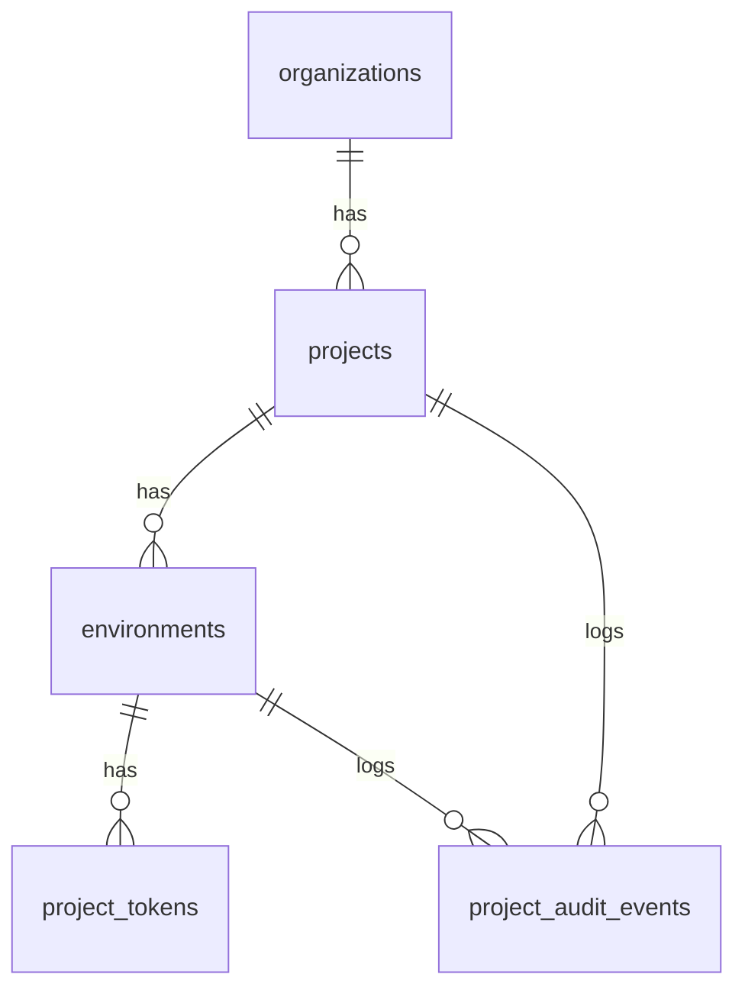

# Technical Specifications - Project and Environment Management

## 1. Domain model and data schema

Core tables:

- `projects`: belongs to `organizations` via `organization_id`.
  - Columns: `id`, `organization_id`, `name`, `slug`, `icon`, `description`, `timezone`, `health_status`, `health_computed_at`, `deleted_at`, `created_at`, `updated_at`.
  - `health_status` enum: `healthy`, `degraded`, `unhealthy`, `unknown`.
  - Slug is unique per organization; derived from name when not explicitly provided.

- `environments`: belongs to `projects` via `project_id`.
  - Columns: `id`, `project_id`, `organization_id`, `name`, `slug`, `is_primary`, `status` (`active`, `archived`), `deleted_at`, `created_at`, `updated_at`.
  - Name unique within same project.

- `project_tokens`: environment-scoped token lifecycle table.
  - Columns: `id`, `environment_id`, `project_id`, `organization_id`, `token_hash` (bcrypt/sha256), `label`, `status` (`active`, `deprecated`, `revoked`), `grace_expires_at`, `revoked_at`, `created_by`, `created_at`.
  - Multiple tokens per environment; only one `active` primary token at any time.
  - `deprecated` grace tokens remain valid until `grace_expires_at`.

- `project_audit_events`: audit trail for project/environment actions.
  - Columns: `id`, `organization_id`, `project_id`, `environment_id`, `actor_id`, `event_type`, `meta` (jsonb), `ip`, `user_agent`, `created_at`.



## 2. Lifecycle services

- `ProjectService`: handles `create`, `update`, `softDelete`, `restore`.
  - Soft delete sets `deleted_at` and immediately blocks new ingestion for all project environments.
  - Restore clears `deleted_at` within retention window; beyond that, restore is blocked.
  - Deletion is async-safe: existing telemetry remains readable; ingestion tokens are invalidated inline.

- `EnvironmentService`: handles `create`, `update`, `rename`, `archive`, `restore`.
  - Archiving sets `status = archived` and stops new token issuance and ingestion routing.
  - Primary environment flag (`is_primary`) is exclusive per project; reassigned atomically.

- `ProjectHealthService`: periodic health computation job.
  - Runs at minimum every 60 seconds per project.
  - Reads: last ingest timestamp per environment, routing failure ratio (last 5 minutes), ingest error ratio.
  - Writes computed `health_status` to project row without triggering a new audit event.
  - Expose as computed read-only field in project detail response (not recalculated per request).

## 3. Token lifecycle

Token creation:
- Generate cryptographically random 64-byte secret; display once to user in plaintext.
- Store `sha256(secret)` in `token_hash` column; never store plaintext.
- Initial creation happens automatically at environment creation as part of onboarding flow.

Token rotation:
1. Generate new secret; store new token with `status = active`.
2. Set previous active token to `status = deprecated` with `grace_expires_at = now() + grace_window`.
3. If `grace_window = 0`, mark previous token `status = revoked` immediately.
4. Only one `active` token per environment at any time; multiple `deprecated` tokens can coexist during grace period.

Token validation (at ingestion time):
- Accept `active` tokens unconditionally.
- Accept `deprecated` tokens only when `grace_expires_at > now()`.
- Reject `revoked` tokens with `401`; log audit event.
- Background job purges expired grace tokens daily.

Manual revocation:
- Set `status = revoked`, `revoked_at = now()` immediately.
- Write audit event with actor + reason.

## 4. Health status computation

Health status is derived from three signals, computed by `ProjectHealthService`:

| Signal | Condition | Weight |
|--------|-----------|--------|
| Heartbeat freshness | Last ingest < 5 min ago | Required for `healthy` |
| Routing failure ratio | < 1% failures in last 5 min | Required for `healthy` |
| Ingest error ratio | < 5% errors in last 5 min | Required for `healthy` |

Status resolution:
- `healthy`: all signals pass.
- `degraded`: one signal fails or no data in last 5–30 min.
- `unhealthy`: multiple signals fail or routing completely down.
- `unknown`: no ingest data ever received or environment is newly created.

## 5. API routes and contracts

| Method | Route | Purpose | Auth Required |
|--------|-------|---------|---------------|
| GET | `/projects` | List org projects (paginated) | `project:view` |
| POST | `/projects` | Create project | `project:create` |
| GET | `/projects/{project}` | Get project detail + health | `project:view` |
| PUT | `/projects/{project}` | Update project metadata | `project:update` |
| DELETE | `/projects/{project}` | Soft-delete project | `project:delete` |
| POST | `/projects/{project}/restore` | Restore soft-deleted project | `project:delete` |
| GET | `/projects/{project}/environments` | List environments | `project:view` |
| POST | `/projects/{project}/environments` | Create environment | `project:update` |
| PUT | `/projects/{project}/environments/{env}` | Update environment | `project:update` |
| POST | `/projects/{project}/environments/{env}/archive` | Archive environment | `project:update` |
| POST | `/projects/{project}/environments/{env}/tokens` | Generate new token | `project:update` |
| POST | `/projects/{project}/environments/{env}/tokens/{token}/rotate` | Rotate token | `project:update` |
| DELETE | `/projects/{project}/environments/{env}/tokens/{token}` | Revoke token | `project:update` |

Key response shape for project detail:
```json
{
  "id": "uuid",
  "name": "string",
  "slug": "string",
  "icon": "string",
  "description": "string|null",
  "health_status": "healthy|degraded|unhealthy|unknown",
  "health_computed_at": "ISO8601",
  "environments": [{ "id": "uuid", "name": "string", "is_primary": true, "status": "active" }],
  "created_at": "ISO8601"
}
```

Token creation response (displayed once, never again):
```json
{
  "id": "uuid",
  "plaintext_token": "nw_live_xxxxxxxxxxxxx",
  "created_at": "ISO8601"
}
```

## 6. Data access and isolation

- Every query is scoped by `organization_id` before any other filter; implemented via global Eloquent scope or explicit repository constraint.
- Organization context middleware (`ResolveOrganizationContext`) resolves and validates `active_organization_id` on every request.
- Cross-organization navigation is prevented by redirecting to `403` on `organization_id` mismatch between URL params and session context.
- Project soft-delete blocks ingestion atomically: token validation checks `project.deleted_at IS NULL` inline.
- All token hashes are never returned in API responses; only token `id`, `label`, `status`, `created_at`, `grace_expires_at` are exposed.

Audit events written for:
- `project.created`, `project.updated`, `project.deleted`, `project.restored`
- `environment.created`, `environment.updated`, `environment.archived`
- `token.created`, `token.rotated`, `token.revoked`

Each audit event includes: `actor_id`, `organization_id`, `project_id`, `environment_id` (when applicable), `event_type`, `meta` (diff snapshot), `ip`, `user_agent`, `created_at`.

## 7. Frontend integration

- Inertia pages: `Projects/Index`, `Projects/Show`, `Projects/Settings`, `Environments/Settings`.
- Project health badge is polled on a short interval (30s) using Inertia's polling mechanism.
- Token creation modal shows plaintext token in a copy-to-clipboard field; closing the modal marks it as acknowledged (cannot be retrieved again).
- Environment mutation (create, archive, rename) triggers optimistic update of the active environment context cookie only after successful server commit.
- Grace window selector is exposed as a preset dropdown: `Immediate`, `15 minutes`, `1 hour`, `24 hours`.

## 8. Test strategy

Key feature tests:
- Project creation with slug derivation from name and uniqueness enforcement.
- Environment creation, archiving, and primary flag reassignment.
- Token generation, rotation with grace window, and revocation.
- Token validation: `active` accepted, `deprecated` within grace window accepted, `deprecated` after grace rejected, `revoked` always rejected.
- Soft-delete blocks ingestion for all environments in project.
- Cross-organization access denied (403) for all project routes.
- Health status computation job correctly updates all four states.
- Audit events written for all mutating operations.

## Related Resources

- **Functional Spec**: [specs.md](./specs.md)
- **Related Specs**: [organisation/specs.md](../organisation/specs.md), [api/specs.md](../api/specs.md), [analytics/specs.md](../analytics/specs.md)
